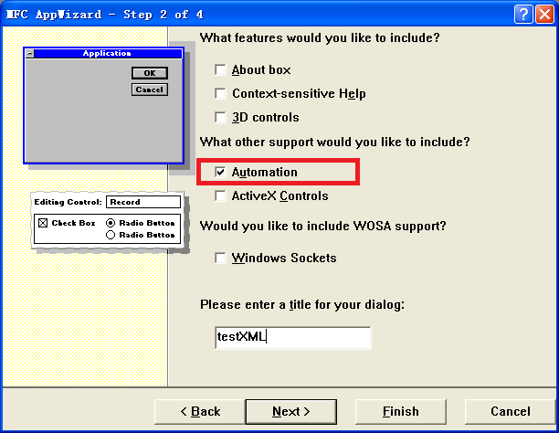

# VC6.0读取xml文件中的内容

## 软件安装

- 如果下面的代码编译无法通过，可能是相关XML读取的补丁程序尚未安装，尤其是在WindowsXP环境。

  `Microsoft XML Core Services 4.0 Service Pack 3 安全更新程序 (KB2758694)`

  - 微软官方下载地址：

    https://www.microsoft.com/zh-CN/download/confirmation.aspx?id=36292

    https://www.catalog.update.microsoft.com/Search.aspx?q=973685
    
    正常下载、安装之后，就能正常编译通过。
    
  - 本地直接下载（[简体中文](sources/msxml4-KB2758694-chs.zip)）：

## 代码开发

- 新建工程

  建立一个基于对话框的程序，工程名为**testXML**。

  

  按照如上画面建立工程后，**CTestXMLApp**中有如下**OLE**初始化代码：

  ```C++
  BOOL CTestXMLApp::InitInstance()
  {
  	// Initialize OLE libraries
  	if (!AfxOleInit())
  	{
  		AfxMessageBox(IDP_OLE_INIT_FAILED);
  		return FALSE;
  	}
      …….
  }
  ```

- **XML创建**

  在对话框中增加一个按钮，ID为**IDC_CREATE**，我们在这个按钮的响应函数中生成一个xml文件。
  
  ```C++
  void CTestXMLDlg::OnCreate()
  {
      MSXML2::IXMLDOMDocumentPtr pDoc;
      MSXML2::IXMLDOMElementPtr xmlRoot ;
      // 创建DOMDocument对象
      HRESULT hr = pDoc.CreateInstance(__uuidof(MSXML2::DOMDocument30));
      if(!SUCCEEDED(hr))
      {
      	MessageBox("无法创建DOMDocument对象，请检查是否安装了MS XML Parser 运行库!");
      }
  
      // 根节点的名称为china
      pDoc->raw_createElement((_bstr_t)(char*)"china", &xmlRoot);
      pDoc->raw_appendChild(xmlRoot, NULL);
  
      MSXML2::IXMLDOMElementPtr childNode ;
      pDoc->raw_createElement((_bstr_t)(char*)"City", &childNode);
      childNode->Puttext("WuHan");					// 节点值
      childNode->setAttribute("population","8,000,000");// 属性名,属性值
      childNode->setAttribute("area","10000");
      xmlRoot->appendChild(childNode);
  
      pDoc->raw_createElement((_bstr_t)(char*)"City", &childNode);
      childNode->Puttext("ShangHai");
      childNode->setAttribute("population","12,000,000");
      childNode->setAttribute("area","12000");
      xmlRoot->appendChild(childNode);
  
      // 保存到文件
      // 如果不存在就建立，存在就覆盖。
      pDoc->save("d://he.xml");
  }
  ```
  
  不要忘了引入类型库
  ```C++
  #import "msxml4.dll" 	// 引入类型库
  ```

- XML读取
  
  再增加一个按钮，ID为**IDC_GET**，在这个按钮的响应函数中读取xml文件。

  ```C++
  void CTestXMLDlg::OnGet()
  {
      // 创建DOMDocument对象
      MSXML2::IXMLDOMDocumentPtr pDoc;
      HRESULT hr = pDoc.CreateInstance(__uuidof(MSXML2::DOMDocument30));
      if(!SUCCEEDED(hr))
      {
      	MessageBox("无法创建DOMDocument对象，请检查是否安装了MS XML Parser 运行库!");
      }
      // 加载文件
      pDoc->load("d://he.xml");
  
      // 在树中查找名为City的节点,"//"表示在任意一层查找
      MSXML2::IXMLDOMElementPtr childNode ;
      childNode = (MSXML2::IXMLDOMElementPtr)(pDoc->selectSingleNode("//City"));
  
      // 得到节点类型
      MSXML2::DOMNodeType nodeType;
      childNode->get_nodeType(&nodeType);
  
      // 节点名称
      BSTR var;
      CString name;
      childNode->get_nodeName(&var);
      name = (char*)(_bstr_t)var;
  
      // 节点值
      VARIANT varVal;
      childNode->get_nodeTypedValue(&varVal);
      CString strValue = (char*)(_bstr_t)varVal;
  
      // 节点属性,放在链表中
      MSXML2::IXMLDOMNamedNodeMapPtr pAttrs = NULL;
      MSXML2::IXMLDOMNodePtr pAttrItem;
      childNode->get_attributes(&pAttrs);
      long nCount ;
      pAttrs->get_length(&nCount);
      for(int i = 0 ; i < nCount ; i++)
      {
          pAttrs->get_item(i,&pAttrItem);
          // 我们可以通过函数get_nodeName,get_nodeTypedValue得到属性名和属性值 
          // 也可以直接得到 
          CString strAttrName = (char*)(_bstr_t)pAttrItem->nodeName;
          CString strAttrValue = (char*)(_bstr_t)pAttrItem->nodeTypedValue;
      }
  }
  ```


## 代码下载

- [代码下载](sources/testXML.zip)

  本人写的代码，亲测没有问题。

